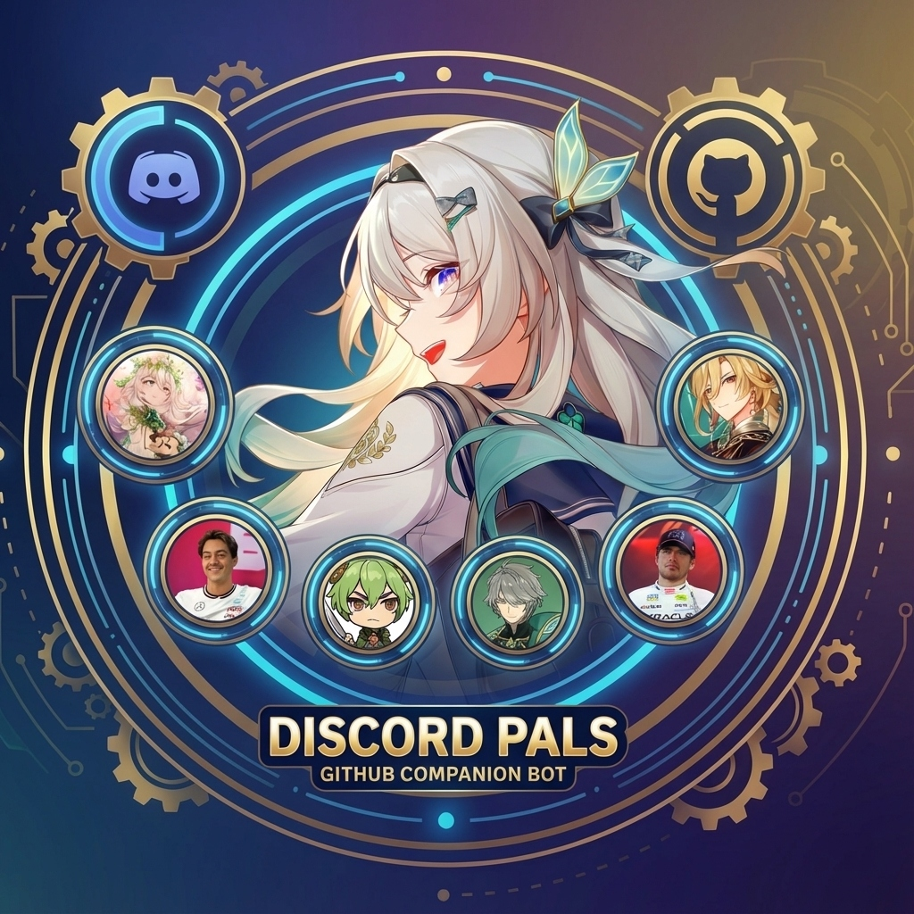

# Discord Pals


Heavily inspired by SpicyMarinara's [Discord Buddy](https://github.com/SpicyMarinara/Discord-Buddy) repo.

Her tool was so easy to make work, it was amazing.

This is a modified version of Discord Buddy, called Discord Pals, which is a templatized Discord bot that can roleplay as any character loaded from simple markdown files. Supports cloud AI providers (OpenAI-compatible APIs work, DeepSeek, etc.) or your own local LLM.

The system instructions were authored by legendary chef @Geechan.

<p align="center">
  
</p>

## Table of Contents

- [Features](#features)
- [Requirements](#requirements)
- [Quick Start](#quick-start)
- [AI Provider Setup](#ai-provider-setup)
- [Web Dashboard](#️-web-dashboard)
- [Memory Architecture](#-memory-architecture)
- [Commands](#-commands)
- [Autonomous Mode](#-autonomous-mode)
- [Bot-on-Bot Fall-off](#-bot-on-bot-fall-off)
- [Impersonation Prevention](#-impersonation-prevention)
- [Creating Characters](#creating-characters)
- [Running Multiple Bots](#running-multiple-bots)
- [Runtime Configuration](#️-runtime-configuration)
- [Deployment & Production](#-deployment--production)
- [File Structure](#file-structure)
- [Troubleshooting](#troubleshooting)
- [Tips](#tips)

---

## Features

- **Any character** - Load characters from markdown files with persona, example dialogue, and special user contexts
- **Image recognition** - Send images to the bot and it will see and respond to them (requires vision-capable model)
- **Plug-and-play AI providers** - Configure via JSON, no code changes
- **Local LLM support** - Use llama.cpp, Ollama, LM Studio, or any OpenAI-compatible API
- **Provider fallback** - Auto-retry with backup providers if one fails
- **Vision-aware fallback** - Non-vision providers automatically receive text-only messages
- **Rate limit handling** - Automatic retry with exponential backoff on 429 errors
- **Web dashboard** - Full web UI for managing:
  - Memories and lore editing (with user name resolution)
  - Character files and live preview
  - System prompts with placeholder reference
  - Runtime config (history limit, provider switching)
  - Context visualization with token estimates
  - Message stats (daily counts, response times, top users)
  - Live log streaming
  - Autonomous channel monitoring
- **Character hot-swap** - Switch characters via dashboard or `/switch` command
- **Multi-bot support** - Run multiple bots from a single terminal/process
- **Memory system** - Per-character isolation with cross-server user profiles
- **Auto-memory** - Automatically remembers important facts from conversations
- **History persistence** - Conversation history survives restarts
- **Mention-triggered context** - Gathers ephemeral context about mentioned users without storing
- **Instant responses** - Bot responds to every message immediately (no batching delay)
- **Memory deduplication** - Automatically prevents duplicate memories from being stored
- **Bot-bot control** - `/stop` command to pause bot-to-bot reply chains globally
- **Bot-on-bot fall-off** - Progressive probability decay prevents infinite bot conversations
- **Impersonation prevention** - Bots won't roleplay as each other in multi-bot setups
- **Context-aware commands** - Slash commands use chat history and memories
- **17 fun commands** - `/kiss`, `/hug`, `/bonk`, `/cuddle`, `/roast`, `/affection`, and more
- **Smart responses** - Tracks reply chains with full message context
- **Anti-spam** - Request queue with rate limiting built-in
- **History recall** - Recover context with `/recall` (up to 200 messages)
- **Autonomous mode** - Bot randomly joins conversations (configurable per-channel)
  - Name triggers (responding to nickname mentions) are now a subset of autonomous mode
  - Per-channel control over whether bots/apps can trigger responses
  - Configurable response chance and cooldown per channel

---

## Requirements

1. **Python 3.10+** - [Download here](https://www.python.org/downloads/)
   - **Recommended:** Python 3.11 or 3.12 for best compatibility
   - Python 3.13+ is supported (audioop-lts is installed automatically)
2. **A Discord Bot Token** - [Get one here](#step-3-create-your-discord-bot)
3. **An AI Provider** - **Any** OpenAI-compatible API:
   - Cloud API (DeepSeek, OpenAI, Anthropic via OpenRouter)
   - Local LLM (llama.cpp, Ollama, LM Studio)

### Python Dependencies

All dependencies are listed in `requirements.txt` with pinned versions:

| Package | Version | Purpose |
|---------|---------|---------|
| discord.py | 2.3.2 | Discord API client |
| openai | >=1.51.0 | OpenAI-compatible API client |
| python-dotenv | 1.0.1 | Environment variable loading |
| aiohttp | >=3.10.0 | Async HTTP client |
| flask | 3.1.2 | Web dashboard |
| pyyaml | 6.0.2 | YAML configuration parsing |
| prometheus-client | 0.20.0 | Metrics and monitoring |
| audioop-lts | >=0.2.1 | Python 3.13+ compatibility |

Install with: `pip install -r requirements.txt`

---

## Quick Start

### Step 1: Get the Code

```bash
git clone https://github.com/TheLonelyDevil9/discord-pals.git
cd discord-pals
```

### Step 2: Run Interactive Setup

**Windows:**

Double-click `setup.bat`

**Mac/Linux:**

```bash
chmod +x setup.sh
./setup.sh
```

The setup wizard will:

1. Create a Python virtual environment
2. Install all dependencies
3. Prompt you for AI providers (count, URLs, models)
4. Prompt you for Discord bots (single or multi-bot)
5. Generate `providers.json`, `bots.json`, and `.env`
6. Open `.env` for you to add API keys

### Step 3: Create Your Discord Bot

1. Go to [Discord Developer Portal](https://discord.com/developers/applications)
2. Click **"New Application"** → Name it → Click **"Create"**
3. Go to **"Bot"** in the left sidebar
4. Click **"Reset Token"** → Copy the token (save it!)
5. Enable these **Privileged Intents**:
   - PRESENCE INTENT
   - SERVER MEMBERS INTENT
   - MESSAGE CONTENT INTENT
6. Go to **"OAuth2"** → **"URL Generator"**
7. Check: `bot` and `applications.commands`
8. Under Bot Permissions, check:
   - View Channels
   - Send Messages
   - Read Message History
   - Add Reactions
   - Use External Emojis
   - Manage Messages

9. Copy the generated URL and open it to invite your bot!

### Step 4: Configure AI Provider

See [AI Provider Setup](#-ai-provider-setup) below for detailed instructions.

### Step 5: Configure the environment

1. Copy the contents of `.env.example` to a new file called `.env`
2. Add your tokens. Any of the below can be set up in .env:

```
Used by providers.json - add keys for your configured providers.

OPENAI_API_KEY=your_openai_api_key
OPENROUTER_API_KEY=your_openrouter_api_key
DEEPSEEK_API_KEY=your_deepseek_api_key
LOCAL_API_KEY=optional
```

### Step 6: Run the Bot

**Windows**

Double click `run.bat`.

**Mac/Linux**

```bash
chmod +x run.sh
./run.sh
```

You should see:

```text
Loaded character: <Your Bot Here>
Synced __ commands (STC)
YourBot#1234 is online!
```

---

## AI Provider Setup

Discord Pals supports any OpenAI-compatible API. Choose your provider:

### Option A: DeepSeek (Recommended - Cheap & Good)

1. Go to [platform.deepseek.com](https://platform.deepseek.com/)
2. Create account → Add credits ($2-5 is plenty)
3. Go to API Keys → Create new key
4. Add to `.env`:

   ```env
   DEEPSEEK_API_KEY=sk-xxxxxxxxxxxxxxxx
   ```

5. Create `providers.json`:

   ```json
   {
     "providers": [
       {
         "name": "DeepSeek",
         "url": "https://api.deepseek.com/v1",
         "key_env": "DEEPSEEK_API_KEY",
         "model": "deepseek-reasoner"
       }
     ],
     "timeout": 60
   }
   ```

### Option B: OpenAI

1. Go to [platform.openai.com](https://platform.openai.com/)
2. Create API key
3. Add to `.env`:

   ```env
   OPENAI_API_KEY=sk-xxxxxxxxxxxxxxxx
   ```

4. Create `providers.json`:

   ```json
   {
     "providers": [
       {
         "name": "OpenAI",
         "url": "https://api.openai.com/v1",
         "key_env": "OPENAI_API_KEY",
         "model": "gpt-4o"
       }
     ],
     "timeout": 60
   }
   ```

### Option C: Local LLM (llama.cpp, Ollama, LM Studio, etc)

No API key needed! Just point to your local server:

```json
{
  "providers": [
    {
      "name": "Local LLM",
      "url": "http://localhost:8080/v1",
      "model": "local-model"
    }
  ],
  "timeout": 600
}
```

> **Tip:** For local LLMs, you can omit `key_env` entirely - it auto-detects that no key is needed.

Add placeholder to `.env`:

```env
LOCAL_API_KEY=optional
```

### Multiple Providers (Fallback Chain)

Set up multiple providers for redundancy:

```json
{
  "providers": [
    {
      "name": "Primary - Home Server",
      "url": "http://100.x.x.x:8080/v1",
      "key_env": "LOCAL_API_KEY",
      "model": "llama-3",
      "requires_key": false
    },
    {
      "name": "Fallback - DeepSeek",
      "url": "https://api.deepseek.com/v1",
      "key_env": "DEEPSEEK_API_KEY",
      "model": "deepseek-chat"
    }
  ],
  "timeout": 60
}
```

The bot tries each provider in order until one succeeds.

### Custom Provider Options (`extra_body`)

Some providers support extra request body parameters. Add `extra_body` to your provider config:

```json
{
  "providers": [
    {
      "name": "Custom Provider",
      "url": "https://api.example.com/v1",
      "key_env": "API_KEY",
      "model": "model-name",
      "extra_body": {
        "thinking": {"type": "disabled"},
        "top_k": 20,
        "repetition_penalty": 1.1
      }
    }
  ],
  "timeout": 60
}
```

The `extra_body` object is merged into the API request, useful for provider-specific parameters.

### Vision Support (`supports_vision`)

By default, all providers are assumed to support vision/image recognition. For text-only models (like DeepSeek Reasoner), add `"supports_vision": false`:

```json
{
  "providers": [
    {
      "name": "Claude (Vision)",
      "url": "https://api.anthropic.com/v1",
      "key_env": "ANTHROPIC_API_KEY",
      "model": "claude-sonnet-4-20250514"
    },
    {
      "name": "DeepSeek (Text Only)",
      "url": "https://api.deepseek.com/v1",
      "key_env": "DEEPSEEK_API_KEY",
      "model": "deepseek-reasoner",
      "supports_vision": false
    }
  ],
  "timeout": 60
}
```

When a user sends an image:

- **Vision providers** receive the full multimodal content (text + image)
- **Non-vision providers** receive text-only with a note: "[User sent an image that this model cannot see]"

This allows graceful fallback - if your primary vision provider fails, a text-only fallback can still respond (without seeing the image).

### SillyTavern-Style YAML Parameters (`include_body` / `exclude_body`)

For more flexible configuration, use YAML strings:

```json
{
  "providers": [
    {
      "name": "GLM-4.7 (Reasoning Disabled)",
      "url": "https://api.z.ai/api/paas/v4",
      "key_env": "ZAI_API_KEY",
      "model": "glm-4.7",
      "include_body": "thinking:\n  type: disabled",
      "exclude_body": "- frequency_penalty\n- presence_penalty"
    }
  ]
}
```

- `include_body`: YAML string merged into the request (supports nested objects)
- `exclude_body`: YAML list of keys to remove from the request

This is useful for:

- Disabling reasoning/thinking mode on GLM models
- Adding sampler parameters for local LLMs
- Removing unsupported parameters for specific providers

### Diagnosing Provider Issues

Run the built-in diagnostics script:

```bash
python diagnose.py
```

This checks:

- Configuration files exist
- API keys are set
- Provider connectivity
- Model availability

---

## 🖥️ Web Dashboard

Discord Pals includes a full web dashboard for managing your bot without touching config files or restarting.

### Accessing the Dashboard

The dashboard starts automatically when you run the bot:

```bash
python main.py
```

Open your browser to: **<http://localhost:5000>**

> **Note:** The dashboard only accepts connections from localhost by default for security. See [Deployment & Production](#-deployment--production) for remote access options.

### Dashboard Security

The dashboard supports optional password protection via environment variables:

```env
DASHBOARD_USER=admin
DASHBOARD_PASS=your_secure_password
```

When `DASHBOARD_PASS` is set:

- All dashboard pages require login
- A login page appears at `/login`
- Sessions persist until logout or browser close
- A "Logout" link appears in the navigation bar

When `DASHBOARD_PASS` is **not set**:

- Authentication is disabled (local-only mode)
- Dashboard is fully accessible without login
- Recommended only for localhost access

**CSRF Protection:** All forms include CSRF tokens to prevent cross-site request forgery attacks.

### Dashboard Home

The main dashboard shows:

- **Bot Status** - Online/offline state for each bot instance
- **Quick Controls** - Pause/resume bot responses
- **Killswitch** - Emergency stop for all bot activity (sets `global_paused: true`)
- **Bot Interactions Toggle** - Pause bot-to-bot conversations globally

### Characters Page

Manage your character files directly from the browser:

- **View/Edit Characters** - Edit `.md` files in `characters/` folder
- **Live Preview** - See how your character will be parsed
- **System Prompts** - Edit `prompts/system.md` and `prompts/chatroom_context.md`
- **Placeholder Reference** - Quick reference for available placeholders (`{{char}}`, `{{user}}`, etc.)
- **Per-Character Provider** - Select preferred AI provider tier for each character

Changes are saved immediately. Use `/reload` in Discord or click the reload button to apply changes.

### Memories & Lore Page

Manage all memory types:

- **Server Memories** - Shared events and facts for the server
- **User Memories** - Per-user facts (with Discord username resolution)
- **DM Memories** - Private conversation memories per character
- **Global User Profiles** - Cross-server facts that follow users
- **Lore** - World-building information shared across characters

Features:

- Add, edit, and delete memories
- Filter by server, user, or character
- User ID to username resolution for readability
- **Collapsible Cards** - Click card headers to collapse/expand (large files collapse by default)
- **Format JSON** - Button in raw editor to pretty-print and validate JSON

### Channels Page

Configure autonomous mode per channel:

- **Enable/Disable** - Toggle autonomous responses for each channel
- **Response Chance** - Set probability (1-50%) of responding to messages
- **Cooldown** - Minimum time between autonomous responses (1-10 minutes)
- **Bot Triggers** - Allow/disallow other bots from triggering responses (quick toggle badge in table)
- **Sortable Columns** - Click column headers to sort by Channel, Server, History, or Autonomous status
- **Clear History** - Remove conversation history for specific channels

Click the channel name to expand settings, or use the quick toggle to enable/disable.

### Config Page

Adjust runtime settings without restarting:

- **History Limit** - Messages included in context (default: 200)
- **Name Trigger Chance** - Probability of responding to name mentions
- **Provider Selection** - Switch between configured providers
- **Single User Mode** - SillyTavern-style message formatting

See [Runtime Configuration](#️-runtime-configuration) for details on each setting.

### Logs & Stats Page

Monitor your bot in real-time:

- **Live Log Stream** - Watch bot activity as it happens (with server-side clear)
- **Message Stats** - Daily message counts, response times, top users
- **Context Visualization** - See exactly what context is sent to the AI (live polling every 3 seconds)
- **Error Tracking** - View recent errors and provider failures

---

## 🧠 Memory Architecture

The bot uses a layered memory system for intelligent context management:

| Memory Type | Scope | File Location |
|-------------|-------|---------------|
| **Global User Profile** | Cross-server (follows users everywhere) | `bot_data/user_profiles.json` |
| **DM Memories** | Per-character (each character has own DM memories) | `bot_data/dm_memories/{character}.json` |
| **User Memories** | Per-character, per-server | `bot_data/user_memories/{character}.json` |
| **Server Memories** | Shared across all characters | `bot_data/memories.json` |
| **Lore** | Shared across all characters | `bot_data/lore.json` |

When a user talks to the bot, context is loaded in priority order:

1. Global user profile (facts that follow them across servers)
2. Character-specific memories about that user
3. Server-wide memories

---

## 💬 Commands

### Core Commands

| Command                  | Description                               |
| ------------------------ | ----------------------------------------- |
| `/status`                | Check bot and provider status             |
| `/reload`                | Reload character file (hot-reload)        |
| `/clear`                 | Clear conversation history                |
| `/recall <count>`        | Load last N messages (1-200)              |

### Character Commands

| Command                  | Description                               |
| ------------------------ | ----------------------------------------- |
| `/character list`        | List available characters                 |
| `/character set <name>`  | Switch to a different character           |
| `/character reload`      | Hot-reloads current character file        |

### Memory Commands

| Command                  | Description                               |
| ------------------------ | ----------------------------------------- |
| `/memory <text>`         | Save a memory                             |
| `/memories`              | View saved memories                       |
| `/clearmemories`         | Clear all memories for the current context |
| `/lore <text>`           | Add server lore                           |

### Moderation Commands

| Command                  | Description                               |
| ------------------------ | ----------------------------------------- |
| `/autonomous <on/off>`   | Toggle random responses (5% default)      |
| `/stop [enable]`         | Pause/resume bot-to-bot interactions (flag optional) |
| `/delete_messages <N>`   | Delete bot's last N messages              |

---

## 🤖 Autonomous Mode

Autonomous mode allows bots to randomly join conversations without being explicitly mentioned. This feature is highly configurable per-channel via the web dashboard.

### How It Works

1. **Per-Channel Configuration**: Enable/disable autonomous mode for specific channels
2. **Response Chance**: Set the probability (1-50%) that the bot will respond to any message
3. **Cooldown**: Set minimum time between autonomous responses (1-10 minutes)
4. **Bot Triggers**: Control whether other bots/apps can trigger autonomous responses

### Name Triggers

Name triggers (responding when the bot's name/nickname is mentioned without @) are now a **subset of autonomous mode**:

- Name triggers only work in channels where autonomous mode is enabled
- The `name_trigger_chance` runtime config controls the probability of responding to name mentions
- If `allow_bot_triggers` is disabled for a channel, bots cannot trigger name-based responses
- **Emoji-safe:** Discord emojis like `:nahida_happy:` won't accidentally trigger nicknames (e.g., "nahida")

### Dashboard Configuration

Access the Channels page in the web dashboard to configure:

1. Click **⚙️ Configure** on any channel
2. Toggle **Enable Autonomous Responses**
3. Adjust **Response Chance** slider (1-50%)
4. Adjust **Cooldown** slider (1-10 minutes)
5. Toggle **🤖 Allow Bot Triggers** to control whether other bots can trigger responses

Channels with bot triggers enabled show a 🤖 icon in the status column.

### Quick Toggle

Click the ON/OFF badge in the Autonomous column to quickly enable/disable autonomous mode while preserving other settings.

### Fun Commands (17 total!)

| Command        | Description                    |
| -------------- | ------------------------------ |
| `/affection`   | Check affection level          |
| `/kiss`        | Kiss the bot                   |
| `/hug`         | Hug the bot                    |
| `/bonk`        | Bonk the bot                   |
| `/bite`        | Bite the bot                   |
| `/pat`         | Pat the bot's head             |
| `/poke`        | Poke the bot                   |
| `/tickle`      | Tickle the bot                 |
| `/slap`        | Slap the bot                   |
| `/cuddle`      | Cuddle with the bot            |
| `/holdhands`   | Hold hands with the bot        |
| `/squish`      | Squish the bot's face          |
| `/spank`       | Spank the bot                  |
| `/joke`        | Get a joke                     |
| `/compliment`  | Get a compliment               |
| `/roast`       | Get roasted (playfully)        |
| `/fortune`     | Get your fortune told          |
| `/challenge`   | Challenge the bot              |

---

## 📉 Bot-on-Bot Fall-off

When running multiple bots, they can get into endless conversation loops. The fall-off system progressively reduces the probability of responding as bot-to-bot exchanges continue.

### How It Works

1. **Consecutive Counter**: Tracks how many bot messages in a row have occurred in a channel
2. **Progressive Decay**: Each consecutive bot message reduces response probability
3. **Hard Limit**: After N consecutive bot messages, stops responding entirely
4. **Human Reset**: Counter resets when ANY human sends ANY message in the channel

### Configuration

Configure via the web dashboard (Config page) or `bot_data/runtime_config.json`:

| Setting | Default | Description |
| ------- | ------- | ----------- |
| `bot_falloff_enabled` | true | Enable/disable the fall-off system |
| `bot_falloff_base_chance` | 0.8 | Starting probability (80%) for first bot response |
| `bot_falloff_decay_rate` | 0.15 | Probability reduction per consecutive bot message |
| `bot_falloff_min_chance` | 0.05 | Minimum probability floor (5%) |
| `bot_falloff_hard_limit` | 10 | Stop responding entirely after this many bot messages |

### Example Decay

With default settings (base: 0.8, decay: 0.15, min: 0.05):

| Bot Messages | Response Chance |
| ------------ | --------------- |
| 1 | 80% |
| 2 | 65% |
| 3 | 50% |
| 4 | 35% |
| 5 | 20% |
| 6+ | 5% (minimum) |
| 10+ | 0% (hard limit) |

---

## 🎭 Impersonation Prevention

In multi-bot setups, bots are automatically prevented from roleplaying as each other.

### How It Works

1. **Bot Detection**: The system detects all other bots in the current channel
2. **System Prompt Injection**: Other bot names are added to the system prompt with instructions not to impersonate them
3. **Per-Message Context**: Updated dynamically based on which bots are present

### What Gets Blocked

- Bot A pretending to speak as Bot B
- Bots writing dialogue for other boots narrating other bots' actions

### No Configuration Needed

This feature is automatic when running multiple bots. The system prompt includes:

```
IMPORTANT: Do NOT roleplay as or impersonate these other bots: [BotA, BotB, ...]
```

---

## Creating Characters

### Basic Character

1. Go to `characters/` folder
2. Create `mycharacter.md`:

```markdown
# Character Name

## Persona

Write your character's personality, backstory, appearance, mannerisms here.
Be as detailed as you want - the AI will use all of it!

## Special Users

### YourDiscordName (this has to be the full username such as thelonelydevil)
How to treat this specific user differently.

### DiscordName2
Stuff/special treatment, etc.
```

1. Run `/character set mycharacter`

### Advanced Character Template

```markdown
# Samuel

## Persona

`{{user}}`: Introduction?
`Samuel`: *smiles warmly* "Hey there! I'm Sam - short for Samuel.
I'm a coffee addict, terrible at mornings, and I collect vintage vinyl records."

`{{user}}`: Personality?
`Samuel`: "Hmm, let's see... I'm pretty chill, maybe a bit sarcastic,
definitely loyal to my friends. I hate small talk but I'll debate
philosophy for hours."

```

Samuel's personality: warm, sarcastic, loyal, coffee-addict, night-owl;
Samuel's likes: vinyl records, black coffee, rainy days, deep conversations;
Samuel's dislikes: mornings, small talk, dishonesty;
Samuel's speech: casual, uses contractions, occasional swearing, dry humor;

```

## Provider

primary

## Special Users

### TheLonelyDevil

Samuel's best friend. Very comfortable around them, teases them often.

```

### Per-Character Provider Selection

You can specify a preferred AI provider tier for each character by adding a `## Provider` section to the character file:

```markdown
## Provider

primary
```

Valid values are:
- `primary` - Use the first provider in your fallback chain
- `secondary` - Use the second provider
- `fallback` - Use the third provider
- (empty/omitted) - Use default fallback order

This is useful when different characters work better with different models. For example, you might want a complex character to always use your best model, while simpler characters can use faster/cheaper providers.

The provider dropdown in the character edit page automatically manages this section for you.

## Running Multiple Bots

Run multiple characters from ONE process:

### Step 1: Create `bots.json`

```json
{
  "bots": [
    {"name": "Firefly", "token_env": "FIREFLY_TOKEN", "character": "firefly"},
    {"name": "Nahida", "token_env": "NAHIDA_TOKEN", "character": "nahida"},
    {"name": "Samuel", "token_env": "SAM_TOKEN", "character": "samuel"}
  ]
}
```

### Step 2: Add the **Discord** tokens to `.env`

```env
FIREFLY_TOKEN=your_firefly_bot_token
NAHIDA_TOKEN=your_nahida_bot_token
SAM_TOKEN=your_sam_bot_token
```

### Step 3: Run

```bash
python main.py
```

Output:

```text
Starting 3 bot(s)...
[Firefly] Loaded character: Firefly
[Nahida] Loaded character: Nahida
[Samuel] Loaded character: Samuel
🤖 [Firefly] Fly#1234 is online!
🤖 [Nahida] Nahida#5678 is online!
🤖 [Samuel] Sam#9012 is online!
```

> **Note:** Each bot needs its own Discord Application ID, registration steps 3-1 through 3-9.

---

## ⚙️ Runtime Configuration

These settings can be adjusted via the web dashboard or by editing `bot_data/runtime_config.json`. Changes take effect immediately without restarting.

| Setting | Default | Description |
| ------- | ------- | ----------- |
| `history_limit` | 200 | Maximum messages included in AI context. Higher = more memory, slower responses |
| `immediate_message_count` | 5 | Recent messages placed after the chatroom context block |
| `bot_interactions_paused` | false | Pause all bot-to-bot conversations |
| `global_paused` | false | **KILLSWITCH** - Stops all bot responses immediately |
| `use_single_user` | false | SillyTavern-style formatting (all messages from one "user") |
| `name_trigger_chance` | 1.0 | Probability (0.0-1.0) of responding when name is mentioned |
| `raw_generation_logging` | false | Log raw AI output before processing (for debugging) |
| `bot_falloff_enabled` | true | Enable progressive response decay for bot-to-bot conversations |
| `bot_falloff_base_chance` | 0.8 | Starting probability (80%) for first bot response |
| `bot_falloff_decay_rate` | 0.15 | Probability reduction per consecutive bot message |
| `bot_falloff_min_chance` | 0.05 | Minimum probability floor (5%) before hard limit |
| `bot_falloff_hard_limit` | 10 | Stop responding entirely after this many consecutive bot messages |

### When to Adjust Settings

**Slow responses?**

- Lower `history_limit` (try 100)

**Bot missing context?**

- Increase `history_limit`
- Increase `immediate_message_count`

**Too many responses?**

- Lower `name_trigger_chance`
- Disable autonomous mode in specific channels

**Debugging issues?**

- Enable `raw_generation_logging` temporarily

---

## 🚀 Deployment & Production

Run your bot 24/7 on a server or VPS.

### Windows (Task Scheduler)

1. Open Task Scheduler (`taskschd.msc`)
2. Click **Create Basic Task**
3. Name: "Discord Pals Bot"
4. Trigger: **When the computer starts**
5. Action: **Start a program**
6. Program: `C:\path\to\discord-pals\run.bat`
7. Check **Open Properties dialog** → Finish
8. In Properties, check **Run whether user is logged on or not**

To run hidden (no console window), create a VBS wrapper:

```vbs
' run_hidden.vbs
Set WshShell = CreateObject("WScript.Shell")
WshShell.Run "cmd /c cd /d C:\path\to\discord-pals && venv\Scripts\python.exe main.py", 0
Set WshShell = Nothing
```

### Linux (systemd)

1. Create service file:

```bash
sudo nano /etc/systemd/system/discord-pals.service
```

2. Add this content:

```ini
[Unit]
Description=Discord Pals Bot
After=network.target

[Service]
Type=simple
User=your-username
WorkingDirectory=/opt/discord-pals
ExecStart=/opt/discord-pals/venv/bin/python main.py
Restart=always
RestartSec=10
Environment=PYTHONUNBUFFERED=1

[Install]
WantedBy=multi-user.target
```

3. Enable and start:

```bash
sudo systemctl daemon-reload
sudo systemctl enable discord-pals
sudo systemctl start discord-pals
```

4. Check status:

```bash
sudo systemctl status discord-pals
sudo journalctl -u discord-pals -f  # Live logs
```

### Docker

Create a `Dockerfile`:

```dockerfile
FROM python:3.11-slim

WORKDIR /app
COPY requirements.txt .
RUN pip install --no-cache-dir -r requirements.txt

COPY . .

CMD ["python", "main.py"]
```

Create `docker-compose.yml`:

```yaml
version: '3.8'
services:
  discord-pals:
    build: .
    restart: unless-stopped
    volumes:
      - ./bot_data:/app/bot_data
      - ./characters:/app/characters
      - ./prompts:/app/prompts
      - ./.env:/app/.env:ro
      - ./providers.json:/app/providers.json:ro
      - ./bots.json:/app/bots.json:ro
    ports:
      - "5000:5000"  # Dashboard (optional, remove for security)
```

Run with:

```bash
docker-compose up -d
docker-compose logs -f  # View logs
```

### VPS/Cloud Hosting Tips

**Recommended specs:**

- 1 GB RAM minimum (2 GB for multiple bots)
- 1 vCPU
- 10 GB storage

**Security considerations:**

- Dashboard binds to `localhost:5000` by default - this is intentional
- To access remotely, use SSH tunneling: `ssh -L 5000:localhost:5000 user@your-server`
- Or set up a reverse proxy with authentication (nginx example below)

**Nginx reverse proxy with basic auth:**

```nginx
server {
    listen 443 ssl;
    server_name dashboard.yourdomain.com;

    ssl_certificate /path/to/cert.pem;
    ssl_certificate_key /path/to/key.pem;

    auth_basic "Discord Pals Dashboard";
    auth_basic_user_file /etc/nginx/.htpasswd;

    location / {
        proxy_pass http://127.0.0.1:5000;
        proxy_set_header Host $host;
        proxy_set_header X-Real-IP $remote_addr;
    }
}
```

Create password file: `sudo htpasswd -c /etc/nginx/.htpasswd admin`

---

## File Structure

```text
discord-pals/
├── main.py              # Main bot code
├── config.py            # Settings
├── providers.py         # AI providers
├── character.py         # Character loader
├── memory.py            # Memory system
├── discord_utils.py     # Discord helpers
├── request_queue.py     # Anti-spam
├── startup.py           # Startup validation
├── diagnose.py          # Provider diagnostics
├── setup.bat / setup.sh # Interactive setup
├── run.bat / run.sh     # Start the bot
├── providers.json       # AI provider config
├── bots.json            # Multi-bot config **(Optional)**
├── .env                 # Your tokens **(DO NOT COMMIT)**
├── characters/          # Character definitions
│   ├── template.md      # Example template
│   └── your-character.md
├── prompts/             # System prompt templates
│   ├── system.md
│   └── chatroom_context.md
└── bot_data/            # Runtime data (memories, lore)
```

---

## Troubleshooting

### "DISCORD_TOKEN not set!"

→ Create `.env` file with your token (not `.env.example`)

### "No characters available!"

→ Add `.md` files to `characters/` folder

### Bot online but doesn't respond

→ Enable MESSAGE CONTENT INTENT in Discord Developer Portal

### Commands don't show up

→ Wait 1 hour or kick and re-invite the bot

### "All providers failed"

→ Run `python diagnose.py` to check connectivity

### Provider timeout

→ Increase timeout in `providers.json` (try 120+ for local LLMs)

### Character changes not taking effect

→ Use `/reload` command or click reload in the dashboard. Character files are cached until reloaded.

### Dashboard not accessible

→ Dashboard only binds to localhost for security. Access via `http://localhost:5000` on the same machine. For remote access, use SSH tunneling or set up a reverse proxy (see [Deployment & Production](#-deployment--production)).

### Memories not saving

→ Check that `bot_data/` folder exists and is writable. The bot creates it automatically, but permissions issues can prevent writes.

### Multiple bots responding to each other endlessly

→ Use `/stop` to pause bot-to-bot interactions, or enable the "Bot Interactions Paused" toggle in the dashboard. You can also disable "Allow Bot Triggers" per-channel in autonomous settings.

### Bot responds to everything (too chatty)

→ Disable autonomous mode in specific channels via the dashboard Channels page. Also check `name_trigger_chance` in runtime config.

### "Rate limited" or 429 errors

→ The bot handles these automatically with exponential backoff. If persistent, you're hitting API limits - consider adding a fallback provider or reducing usage.

### Provider fallback not working

→ Check that multiple providers are configured in `providers.json`. The bot tries them in order. Run `python diagnose.py` to verify all providers are reachable.

### History/context seems wrong

→ Use `/clear` to reset conversation history. Check `history_limit` in runtime config - very high values can cause issues with some providers.

### Bot crashes on startup

→ Common causes:

- Invalid JSON in `providers.json` or `bots.json` (use a JSON validator)
- Missing required environment variables
- Python version too old (need 3.10+)
- Missing dependencies (run `pip install -r requirements.txt`)

---

## Tips

- **Hot-reload:** Edit character files, then `/reload`
- **Switch characters:** Use `/switch` to list or change characters without restart
- **Web dashboard:** Open <http://localhost:5000> when bot is running
- **Test in DMs:** DM the bot directly for quiet testing
- **Check status:** Use `/status` to verify provider health
- **Diagnose issues:** Run `python diagnose.py` for detailed checks

---

## Need Help?

1. **Check Python:** `python --version` (need 3.10+)
2. **Check packages:** `pip list | grep discord`
3. **Run diagnostics:** `python diagnose.py`
4. **Check logs:** Look for error messages in terminal

---

Made with ❤️ by TLD (and Opus 4.5).

Credits to SpicyMarinara again for the inspiration, and Geechan for naming the project as well as the system prompt!
