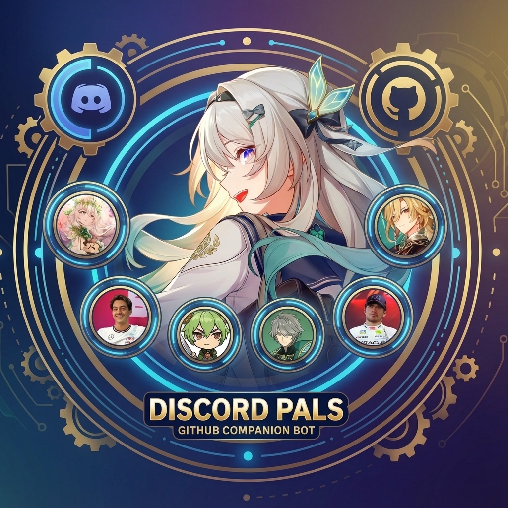

# Discord Pals


Heavily inspired by SpicyMarinara's [Discord Buddy](https://github.com/SpicyMarinara/Discord-Buddy) repo.

Her tool was so easy to make work, it was amazing.

This is a modified version of Discord Buddy, called Discord Pals, which is a templatized Discord bot that can roleplay as any character loaded from simple markdown files. Supports cloud AI providers (OpenAI-compatible APIs work, DeepSeek, etc.) or your own local LLM.

The system instructions were authored by legendary chef @Geechan.

<p align="center">
  
</p>

## Table of Contents

- [Features](#features)
- [Requirements](#requirements)
- [Quick Start](#quick-start)
- [AI Provider Setup](#ai-provider-setup)
- [Web Dashboard](#web-dashboard)
- [Memory Architecture](#memory-architecture)
- [Commands](#commands)
- [Reminders & Timezones](#reminders--timezones)
- [Autonomous Mode](#autonomous-mode)
- [Bot-on-Bot Fall-off](#bot-on-bot-fall-off)
- [Impersonation Prevention](#impersonation-prevention)
- [Creating Characters](#creating-characters)
- [Running Multiple Bots](#running-multiple-bots)
- [Multi-Bot Coordination](#multi-bot-coordination)
- [Bot Mentions](#bot-mentions)
- [Runtime Configuration](#runtime-configuration)
- [Deployment & Production](#deployment--production)
- [File Structure](#file-structure)
- [Troubleshooting](#troubleshooting)
- [Tips](#tips)

---

## Features

- **Any character** - Load characters from markdown files with persona, example dialogue, and special user contexts
- **Image recognition** - Send images to the bot and it will see and respond to them (requires vision-capable model)
- **Plug-and-play AI providers** - Configure via JSON, no code changes
- **Local LLM support** - Use llama.cpp, Ollama, LM Studio, or any OpenAI-compatible API
- **Provider fallback** - Auto-retry with backup providers if one fails
- **Vision-aware fallback** - Image attachments automatically fall back to text-only on non-vision providers
- **Durable reminders** - Bots can schedule one-shot in-character reminders from natural conversation or explicit reminder requests
- **Timezone-aware prompts** - Time placeholders and chatroom time context follow user timezone first, then bot timezone, then process timezone
- **Reminder ownership** - Only the specific bot you talked to owns and delivers that reminder later
- **Rate limit handling** - Automatic retry with exponential backoff on 429 errors
- **Web dashboard** - Full web UI for managing:
  - Memories and lore editing (with user name resolution)
  - Character files and live preview
  - System prompts with placeholder reference
  - Runtime config, provider settings, and per-character provider routing
  - Context visualization with token estimates
  - Message stats (daily counts, response times, top users)
  - Live log streaming
  - Autonomous channel monitoring
- **Character hot-swap** - Switch characters via dashboard or `/switch` command
- **Multi-bot support** - Run multiple bots from a single terminal/process
- **Memory system** - Unified 2-store system: auto memory profiles (one per server/user or per-bot DM/user) and manual lore (attachable to users, bots, or servers)
- **Auto-memory** - Automatically remembers important facts from conversations and merges them into the right editable profile
- **Memory consolidation** - LLM-based profile merging prevents long unmanaged auto-memory lists; failed merges keep one pending entry for retry
- **History persistence** - Conversation history survives restarts
- **User-only context mode** - Send only human messages to the LLM (opt-in), reduces impersonation and context poisoning
- **Mention-triggered context** - Gathers ephemeral context about mentioned users without storing
- **Instant responses** - Bot responds to every message immediately (no batching delay)
- **Per-bot DM memory** - DM auto-memory profiles are isolated by bot and user, so different characters do not share a user's private DM profile
- **Bot-bot control** - `/stop` command to pause bot-to-bot reply chains globally
- **Killswitch** - `/pause` command for emergency stop of all bot activity
- **Bot-on-bot fall-off** - Progressive probability decay prevents infinite bot conversations
- **Impersonation prevention** - Bots won't roleplay as each other in multi-bot setups
- **User ignore system** - `/ignore`, `/unignore`, `/ignorelist` to block specific bots from responding to you
- **Context-aware commands** - Slash commands use chat history and memories
- **Flexible interactions** - `/interact` command for hugs, kisses, bonks, roasts, and any custom action
- **Smart responses** - Tracks reply chains with full message context
- **Anti-spam** - Request queue with rate limiting built-in
- **History recall** - Recover context with `/recall` (up to 200 messages)
- **Multi-bot coordination** - Global coordinator prevents crashes when multiple bots tagged simultaneously
- **Reminder management** - `/reminders list` and `/reminders cancel` plus a dashboard reminder queue for admin cleanup
- **Bot @mentions** - Bots can mention users/other bots in responses (configurable)
- **Natural message pacing** - Paragraph breaks can become 2-3 Discord messages when they read like separate chat thoughts
- **Split replies** - Send separate messages to multiple mentioned users
- **Custom nicknames** - Define additional trigger words beyond bot name
- **Autonomous mode** - Bot randomly joins conversations (configurable per-channel)
  - Name triggers (responding to nickname mentions) scoped per-channel via `/nickname-trigger`
  - Per-channel control over whether bots/apps can trigger responses
  - Configurable response chance and cooldown per channel
- **Autonomous DM follow-ups** - Bots send organic follow-up messages in DMs after configurable silence periods
- **Config-respected token limits** - Provider `max_tokens` values are honored directly, including Claude/Opus-style models

---

## Requirements

1. **Python 3.10+** - [Download here](https://www.python.org/downloads/)
   - **Recommended:** Python 3.11 or 3.12 for best compatibility
   - Python 3.13+ is supported (audioop-lts is installed automatically)
2. **A Discord Bot Token** - [Get one here](#step-3-create-your-discord-bot)
3. **An AI Provider** - **Any** OpenAI-compatible API:
   - Cloud API (DeepSeek, OpenAI, Anthropic via OpenRouter)
   - Local LLM (llama.cpp, Ollama, LM Studio)

### Python Dependencies

All dependencies are listed in `requirements.txt`; versions are pinned or ranged there:

| Package | Version | Purpose |
|---------|---------|---------|
| discord.py | 2.3.2 | Discord API client |
| openai | >=1.51.0 | OpenAI-compatible API client |
| python-dotenv | 1.0.1 | Environment variable loading |
| aiohttp | >=3.10.0 | Async HTTP client |
| flask | 3.1.2 | Web dashboard |
| waitress | 3.0.0 | Production WSGI server for the dashboard |
| pyyaml | 6.0.2 | YAML configuration parsing |
| prometheus-client | 0.20.0 | Metrics and monitoring |
| audioop-lts | >=0.2.1 | Python 3.13+ compatibility |
| tzdata | >=2024.1 | IANA timezone database for cross-platform timezone support |

Install with: `pip install -r requirements.txt`

---

## Quick Start

### Step 1: Get the Code

```bash
git clone https://github.com/TheLonelyDevil9/discord-pals.git
cd discord-pals
```

### Step 2: Run Interactive Setup

**Windows:**

Double-click `setup.bat`

**Mac/Linux:**

```bash
chmod +x setup.sh
./setup.sh
```

The setup wizard will:

1. Create a Python virtual environment
2. Install all dependencies
3. Prompt you for AI providers (count, URLs, models)
4. Prompt you for Discord bots (single or multi-bot)
5. Generate `providers.json`, `.env`, and `bots.json` when using multi-bot mode
6. Open `.env` for you to add API keys

When you re-run setup for multi-bot mode, the setup script updates `bots.json` from your latest answers and can append any newly configured bot token variables to an existing `.env`.

### Step 3: Create Your Discord Bot

1. Go to [Discord Developer Portal](https://discord.com/developers/applications)
2. Click **"New Application"** → Name it → Click **"Create"**
3. Go to **"Bot"** in the left sidebar
4. Click **"Reset Token"** → Copy the token (save it!)
5. Enable these **Privileged Intents**:
   - PRESENCE INTENT
   - SERVER MEMBERS INTENT
   - MESSAGE CONTENT INTENT
6. Go to **"OAuth2"** → **"URL Generator"**
7. Check: `bot` and `applications.commands`
8. Under Bot Permissions, check:
   - View Channels
   - Send Messages
   - Read Message History
   - Add Reactions
   - Use External Emojis
   - Manage Messages

9. Copy the generated URL and open it to invite your bot!

### Step 4: Configure AI Provider

See [AI Provider Setup](#ai-provider-setup) below for detailed instructions.

### Step 5: Configure the environment

1. Copy the contents of `.env.example` to a new file called `.env`
2. Add your tokens. Any of the below can be set up in .env:

```env
# Used by providers.json - add keys for your configured providers.

OPENAI_API_KEY=your_openai_api_key
OPENROUTER_API_KEY=your_openrouter_api_key
DEEPSEEK_API_KEY=your_deepseek_api_key
LOCAL_API_KEY=optional
```

### Step 6: Run the Bot

#### Windows

Double click `run.bat`.

#### Mac/Linux

```bash
chmod +x run.sh
./run.sh
```

You should see:

```text
Loaded character: <Your Bot Here>
Synced __ commands (STC)
YourBot#1234 is online!
```

---

## AI Provider Setup

Discord Pals supports any OpenAI-compatible API. Choose your provider:

### Option A: DeepSeek (Recommended - Cheap & Good)

1. Go to [platform.deepseek.com](https://platform.deepseek.com/)
2. Create account → Add credits ($2-5 is plenty)
3. Go to API Keys → Create new key
4. Add to `.env`:

   ```env
   DEEPSEEK_API_KEY=sk-xxxxxxxxxxxxxxxx
   ```

5. Create `providers.json`:

   ```json
   {
     "providers": [
       {
         "name": "DeepSeek",
         "url": "https://api.deepseek.com/v1",
         "key_env": "DEEPSEEK_API_KEY",
         "model": "deepseek-reasoner"
       }
     ],
     "timeout": 60
   }
   ```

### Option B: OpenAI

1. Go to [platform.openai.com](https://platform.openai.com/)
2. Create API key
3. Add to `.env`:

   ```env
   OPENAI_API_KEY=sk-xxxxxxxxxxxxxxxx
   ```

4. Create `providers.json`:

   ```json
   {
     "providers": [
       {
         "name": "OpenAI",
         "url": "https://api.openai.com/v1",
         "key_env": "OPENAI_API_KEY",
         "model": "gpt-4o"
       }
     ],
     "timeout": 60
   }
   ```

### Option C: Local LLM (llama.cpp, Ollama, LM Studio, etc)

No API key needed! Just point to your local server:

```json
{
  "providers": [
    {
      "name": "Local LLM",
      "url": "http://localhost:8080/v1",
      "model": "local-model",
      "timeout": 600
    }
  ],
  "timeout": 60
}
```

> **Tip:** For local LLMs, you can omit `key_env` entirely - it auto-detects that no key is needed.

Add placeholder to `.env`:

```env
LOCAL_API_KEY=optional
```

### Multiple Providers (Fallback Chain)

Set up multiple providers for redundancy:

```json
{
  "providers": [
    {
      "name": "Primary - Home Server",
      "url": "http://100.x.x.x:8080/v1",
      "key_env": "LOCAL_API_KEY",
      "model": "llama-3",
      "requires_key": false
    },
    {
      "name": "Fallback - DeepSeek",
      "url": "https://api.deepseek.com/v1",
      "key_env": "DEEPSEEK_API_KEY",
      "model": "deepseek-chat"
    }
  ],
  "timeout": 60
}
```

The bot tries each provider in order until one succeeds.

### Custom Provider Options (`extra_body`)

Some providers support extra request body parameters. Add `extra_body` to your provider config:

```json
{
  "providers": [
    {
      "name": "Custom Provider",
      "url": "https://api.example.com/v1",
      "key_env": "API_KEY",
      "model": "model-name",
      "extra_body": {
        "thinking": {"type": "disabled"},
        "top_k": 20,
        "repetition_penalty": 1.1
      }
    }
  ],
  "timeout": 60
}
```

The `extra_body` object is merged into the API request, useful for provider-specific parameters.

### Vision Support (`supports_vision`)

By default, all providers are assumed to support vision/image recognition. For text-only models (like DeepSeek Reasoner), add `"supports_vision": false`:

```json
{
  "providers": [
    {
      "name": "Claude (Vision)",
      "url": "https://api.anthropic.com/v1",
      "key_env": "ANTHROPIC_API_KEY",
      "model": "claude-sonnet-4-20250514"
    },
    {
      "name": "DeepSeek (Text Only)",
      "url": "https://api.deepseek.com/v1",
      "key_env": "DEEPSEEK_API_KEY",
      "model": "deepseek-reasoner",
      "supports_vision": false
    }
  ],
  "timeout": 60
}
```

If a provider is mistakenly left vision-enabled but its endpoint rejects image input at runtime, Discord Pals will automatically retry that request as text-only and temporarily treat that tier as non-vision for the rest of the current run.

Emoji and shortcode context remains text-only; Discord Pals does not convert emojis into image references.

When a user sends an image attachment:

- **Vision providers** receive the full multimodal content (text + image)
- **Non-vision providers** receive text-only with a note: "[Visual reference omitted for text-only model]"

This allows graceful fallback - if your primary vision provider fails, a text-only fallback can still respond (without seeing the image).

### SillyTavern-Style YAML Parameters (`include_body` / `exclude_body`)

For more flexible configuration, use YAML strings:

```json
{
  "providers": [
    {
      "name": "GLM-4.7 (Reasoning Disabled)",
      "url": "https://api.z.ai/api/paas/v4",
      "key_env": "ZAI_API_KEY",
      "model": "glm-4.7",
      "include_body": "thinking:\n  type: disabled",
      "exclude_body": "- frequency_penalty\n- presence_penalty"
    }
  ]
}
```

- `include_body`: YAML string merged into the request (supports nested objects)
- `exclude_body`: YAML list of keys to remove from the request

This is useful for:

- Disabling reasoning/thinking mode on GLM models
- Adding sampler parameters for local LLMs
- Removing unsupported parameters for specific providers

### OpenRouter

OpenRouter is auto-detected when your provider URL contains `openrouter.ai`. Discord Pals will automatically:

- Inject `HTTP-Referer` and `X-OpenRouter-Title` headers (for OpenRouter leaderboard attribution)
- Merge any `openrouter` config into the API request body

Add an `openrouter` object to your provider for OpenRouter-specific features:

```json
{
  "providers": [
    {
      "name": "Claude via OpenRouter",
      "url": "https://openrouter.ai/api/v1",
      "key_env": "OPENROUTER_API_KEY",
      "model": "anthropic/claude-sonnet-4",
      "openrouter": {
        "provider": {
          "order": ["anthropic"],
          "allow_fallbacks": true
        },
        "models": ["anthropic/claude-sonnet-4", "openai/gpt-4o"],
        "transforms": ["middle-out"]
      }
    }
  ],
  "timeout": 60
}
```

Common `openrouter` options:

- **`provider.order`** — preferred backend providers (e.g., `["anthropic", "google"]`)
- **`provider.allow_fallbacks`** — allow OpenRouter to try other backends if preferred ones fail (default: `true`)
- **`provider.ignore`** — block specific backends (e.g., `["together"]`)
- **`provider.data_collection`** — set to `"deny"` to avoid providers that store data
- **`provider.sort`** — sort by `"price"`, `"throughput"`, or `"latency"`
- **`models`** — array of fallback models OpenRouter tries in order if the primary model fails
- **`transforms`** — `["middle-out"]` auto-compresses long conversations to fit context limits

These settings are also configurable through the web dashboard when editing an OpenRouter provider.

### Diagnosing Provider Issues

Run the built-in diagnostics script:

```bash
python diagnose.py
```

This checks:

- Configuration files exist
- API keys are set
- Provider connectivity
- Model availability

---

## Web Dashboard

Discord Pals includes a full web dashboard for managing your bot without touching config files or restarting.

### Accessing the Dashboard

The dashboard starts automatically when you run the bot:

```bash
python main.py
```

Open your browser to: **<http://localhost:5000>**

> **Note:** `main.py` starts the dashboard on `0.0.0.0:5000`, so it can be reachable from other devices if your firewall or host allows it. Set `DASHBOARD_PASS` before exposing the port outside a trusted local machine or private network.

### Dashboard Security

The dashboard supports optional password protection via environment variables:

```env
DASHBOARD_USER=admin
DASHBOARD_PASS=your_secure_password
```

When `DASHBOARD_PASS` is set:

- All dashboard pages require login
- A login page appears at `/login`
- Sessions persist until logout or browser close
- A "Logout" link appears in the navigation bar

When `DASHBOARD_PASS` is **not set**:

- Authentication is disabled
- Dashboard is fully accessible without login to any client that can reach port `5000`
- Recommended only for trusted localhost/private-network use

**CSRF Protection:** All forms include CSRF tokens to prevent cross-site request forgery attacks.

### Dashboard Home

The main dashboard shows:

- **Bot Status** - Online/offline state for each bot instance
- **Quick Controls** - Pause/resume bot responses
- **Killswitch** - Emergency stop for all bot activity (sets `global_paused: true`)
- **Bot Interactions Toggle** - Pause bot-to-bot conversations globally

### Characters Page

Manage your character files directly from the browser:

- **View/Edit Characters** - Edit `.md` files in `characters/` folder
- **Live Preview** - See how your character will be parsed
- **System Prompts** - Edit `prompts/system.md` and `prompts/chatroom_context.md`
- **Placeholder Reference** - Quick reference for available placeholders (`{{char}}`, `{{user}}`, etc.)
- **Per-Character Provider** - Select preferred AI provider tier for each character

Changes are saved immediately. Use `/reload` in Discord or click the reload button to apply changes.

### Memories & Lore Page

Manage the bot's memory system:

- **Auto Memory Profiles** — View, edit, delete, and manually merge automatically created profiles per server/user or per-bot DM/user
- **Manual Lore** — Add, edit, and delete lore entries scoped to users, bots, or servers
- **Bulk Cleanup** — Delete selected profile or pending entries, delete auto profiles by one or more users, or delete user lore in bulk
- **Manual Merge** — Run a targeted merge pass for one or more users or a specific memory key
- **Filtering** — Filter auto memory profiles by scope, server, user, and search term
- **User Resolution** — User IDs displayed as readable Discord names
- **Safe Live Editing** — Unified memory raw JSON is view-only; edits, deletes, clears, and merges go through the dashboard actions/API so profile and pending-entry invariants stay in sync

### Reminders Page

Review durable reminders that have been scheduled by conversations:

- **Pending Queue** — Browse pending, completed, skipped, failed, or cancelled reminders
- **Filters** — Filter by bot, user ID, and reminder status
- **Bulk Cancel** — Cancel one or more pending reminders from the dashboard
- **Visibility** — See reminder ownership, delivery location, due time, optional pre-reminder time, and creation mode

### Channels Page

Configure autonomous mode per channel:

- **Enable/Disable** - Toggle autonomous responses for each channel
- **Response Chance** - Set probability (1-50%) of responding to messages
- **Cooldown** - Minimum time between autonomous responses (1-10 minutes)
- **Bot Triggers** - Allow/disallow other bots from triggering responses (quick toggle badge in table)
- **Bot Nicknames** - Edit per-bot trigger aliases used by name-triggered responses
- **Sortable Columns** - Click column headers to sort by Channel, Server, History, or Autonomous status
- **Clear History** - Remove conversation history for specific channels

Click the channel name to expand settings, or use the quick toggle to enable/disable.

### Config Page

Adjust runtime settings without restarting:

- **Context** — History windows, user-only mode, mention context, split replies, and time-passage context. These settings change what the bot sees.
- **Prompting** — Single-user formatting, a read-only `prompts/system.md` preview, and editable `prompts/other_prompts.md` post-system prompt templates.
- **Time** — Bot timezones, availability schedules, and DM follow-up timing. These settings change time awareness or when time-based work can happen.
- **Automation** — Autonomous channel summary, name trigger chance, nicknames, bot-to-bot fall-off, and bot interaction pause controls.
- **Providers** — Provider order, provider definitions, per-character provider preferences, and the reserved active provider field. Provider order can be changed with Up/Down buttons or drag.
- **Performance** — Global concurrency and dashboard performance notes.
- **Maintenance / Advanced** — Slash command sync status, import/export, debug logging, and raw JSON editors.

Prompt editing is split intentionally: `prompts/system.md` is the fixed system prompt surface, while `prompts/other_prompts.md` contains character-facing context that is sent after the system prompt.

See [Runtime Configuration](#runtime-configuration) for details on each setting.

### Logs & Stats Page

Monitor your bot in real-time:

- **Live Log Stream** - Watch bot activity as it happens (with server-side clear)
- **Message Stats** - Daily message counts, response times, top users
- **Context Visualization** - See exactly what context is sent to the AI (live polling every 10 seconds, scroll-safe)
- **Error Tracking** - View recent errors and provider failures

---

## Memory Architecture

The bot uses a unified 2-store memory system:

| Store | Scope | File Location |
| ----- | ----- | ------------- |
| **Auto Memory Profiles** | One profile per `server:{server_id}:user:{user_id}` or `dm:bot:{bot}:user:{user_id}` scope | `bot_data/auto_memories.json` |
| **Manual Lore** | Attachable to users, bots, or servers | `bot_data/manual_lore.json` |

### Auto Memory Profiles

The bot automatically detects and stores important facts from conversations (preferences, relationships, events). Each server/user or per-bot DM/user scope keeps one living `profile` entry in `auto_memories.json`; new facts are merged into that profile immediately when a provider is available.

If the provider merge fails, the bot keeps one temporary `pending` entry for that same key instead of appending more cards. Later automatic retries or the dashboard's **Merge Now** action fold that pending content into the profile after a successful LLM merge. Existing multi-entry legacy keys are queued for this same consolidation path and are not rewritten until the LLM returns a valid merged profile.

The dashboard also supports manual cleanup workflows for auto memory profiles:

- Edit or delete the profile entry for a key
- Edit or delete the single pending entry when one exists
- Delete all auto memory profiles for one or more users in DMs, one server, or all scopes
- Manually merge one specific key or targeted users/scopes in place

User IDs are resolved to readable Discord display names in the dashboard for easy management.

Unified auto-memory and manual-lore raw JSON can be viewed for inspection, but manager-owned stores should be changed through the dashboard cards or v2 memory API. Older `/api/memories/*` routes are compatibility shims for unified stores; retired legacy raw-file mutations return HTTP 410.

### Manual Lore

Lore entries are user-created context that the bot references during conversations. Each entry can be scoped to:

- **Server** — Shared world-building facts for the entire server
- **User** — Facts about a specific user
- **Bot** — Facts about a specific bot/character

Add lore via the dashboard Memories & Lore page, or with the `/lore` slash command.

User lore can also be bulk-deleted by target user from the dashboard without affecting server or bot lore.

### Legacy Migration

If upgrading from v1.7.x or earlier, the old 5-store memory system (server memories, DM memories, user memories, global profiles, lore) is automatically migrated on first startup. Backup files (`.bak`) are created before migration.

---

## Commands

Slash commands include both user-facing actions and maintenance/admin actions. Grouped commands show up in Discord as nested entries such as `/timezone set` and `/reminders list`, not as flat commands.

Regular users should primarily see and use:

- `/interact`
- `/ignore`, `/unignore`, `/ignorelist`
- `/memory`, `/memories`
- `/timezone set`, `/timezone show`, `/timezone clear`
- `/reminders list`, `/reminders cancel`

### Core Commands

| Command | Description |
| ------- | ----------- |
| `/status` | Check bot and provider status |
| `/reload` | Reload character file (hot-reload) |
| `/switch [character]` | Switch to a different character (or list available) |
| `/history clear` | Clear conversation history |
| `/recall [count]` | Load recent messages into context (default 20, max 200) |

### Moderation Commands

| Command | Description |
| ------- | ----------- |
| `/autonomous <enabled> [chance] [cooldown]` | Toggle random responses for the current server channel |
| `/nickname-trigger <enabled>` | Enable/disable nickname-based triggers for this channel |
| `/stop [enable]` | Pause/resume bot-to-bot interactions (flag optional) |
| `/pause [enable]` | KILLSWITCH: Pause/resume ALL bot activity (owner only) |
| `/delete_messages [count]` | Delete the bot's recent messages (default 1, max 20) |

### Memory Commands

| Command | Description |
| ------- | ----------- |
| `/memory <content> [user_id]` | Save a memory about yourself or a user |
| `/memories` | View saved memories |
| `/clearmemories <memory_type> [target_id]` | Clear auto memories or server/user/bot lore |
| `/lore [content] [target_type] [target_id]` | Add or view lore for a server, user, or bot |

### User Commands

| Command | Description |
| ------- | ----------- |
| `/ignore <bot_name>` | Block a bot from responding to you |
| `/unignore <bot_name>` | Allow a bot to respond to you again |
| `/ignorelist` | Show which bots you're ignoring |
| `/interact <action>` | Perform an action (e.g., "hugs you", "tells you a joke") |

### Time & Reminder Commands

| Command | Description |
| ------- | ----------- |
| `/timezone set <iana_timezone>` | Set your personal timezone for prompt time-awareness and reminders, with Discord autocomplete suggestions from the valid IANA timezone list |
| `/timezone show` | Show your effective timezone and where it came from |
| `/timezone clear` | Remove your personal timezone override |
| `/reminders list` | List your pending reminders for the current bot |
| `/reminders cancel <reminder_id>` | Cancel one of your pending reminders for the current bot |

---

## Reminders & Timezones

Reminders are separate from DM follow-ups.

- **DM follow-ups** are silence-based nudges in DMs after a configurable idle period.
- **Reminders** are durable scheduled items stored in `bot_data/reminders.json` and delivered later at a specific time.

### How reminders are created

- The bot can create a reminder from an explicit ask such as “remind me in 3 hours”.
- The bot can also infer a reminder from clear future-planning statements in direct bot interactions, such as “I have a flight at 9 AM on Saturday”.
- If the timing is unclear, the bot asks a clarification question instead of silently guessing.

### How reminders are delivered

- Reminders are **bot-specific**: only the bot you were talking to owns the reminder.
- Reminders are **one-shot** in this release.
- A reminder can include an optional **pre-reminder** plus the main due-time reminder.
- Delivery happens in the **same DM/channel** where the reminder was created. If that source channel is unavailable later, the bot falls back to **DM**.
- The final reminder text is generated **at send time**, in character, using fresh history/context rather than storing a prewritten line.

### Timezone precedence

- **User timezone** from `/timezone set`
- **Bot timezone** from the dashboard Config page
- **Process/server timezone** as the final fallback

This same precedence is used for prompt time placeholders like `{{time}}`, `{{date}}`, `{{weekday}}`, and `{{day}}`, as well as reminder scheduling.

---

## Autonomous Mode

Autonomous mode allows bots to randomly join conversations without being explicitly mentioned. This feature is highly configurable per-channel via the web dashboard.

### How It Works

1. **Per-Channel Configuration**: Enable/disable autonomous mode for specific channels
2. **Response Chance**: Set the probability (1-50%) that the bot will respond to any message
3. **Cooldown**: Set minimum time between autonomous responses (1-10 minutes)
4. **Bot Triggers**: Control whether other bots/apps can trigger autonomous responses

### Name Triggers

Name triggers (responding when the bot's name/nickname is mentioned without @) are scoped per-channel:

- Use `/nickname-trigger <enabled>` to enable or disable name-based triggers for the current channel
- Default is OFF — bots only respond to @mentions and replies unless explicitly enabled
- The `name_trigger_chance` runtime config controls the probability of responding to name mentions
- If `allow_bot_triggers` is disabled for a channel, bots cannot trigger name-based responses
- **Emoji-safe:** Discord emojis like `:nahida_happy:` won't accidentally trigger nicknames (e.g., "nahida")
- Also toggleable from the dashboard Channels page

### Dashboard Configuration

Access the Channels page in the web dashboard to configure:

1. Click **⚙️ Configure** on any channel
2. Toggle **Enable Autonomous Responses**
3. Adjust **Response Chance** slider (1-50%)
4. Adjust **Cooldown** slider (1-10 minutes)
5. Toggle **🤖 Allow Bot Triggers** to control whether other bots can trigger responses

Channels with bot triggers enabled show a 🤖 icon in the status column.

### Quick Toggle

Click the ON/OFF badge in the Autonomous column to quickly enable/disable autonomous mode while preserving other settings.

### Custom Nicknames

Add additional trigger words beyond the bot's Discord name:

- Set per bot from the dashboard Config or Channels page
- Multi-bot nicknames are saved to `bots.json`; single-bot nicknames are saved under `bot_nicknames` in runtime config
- Format: comma-separated list (e.g., "Sam,Sammy,Samuel")
- Works with name trigger system (requires autonomous mode enabled)

### Split Replies

When enabled, the bot sends separate replies to each mentioned user instead of one combined message:

- Enable via `split_replies_enabled: true` in runtime config
- Limit targets with `split_replies_max_targets` (default: 5)
- Useful for personalized responses in group conversations

### DM Follow-ups

When enabled, bots send organic follow-up messages in DMs after a configurable period of silence. This encourages continued conversation without being intrusive.

This is separate from the durable reminder system above. Follow-ups are silence-based and ephemeral; reminders are timestamp-based and persisted.

| Setting | Default | Description |
| ------- | ------- | ----------- |
| `dm_followup_enabled` | false | Enable autonomous DM follow-ups |
| `dm_followup_timeout_minutes` | 120 | Minutes of silence before sending a follow-up |
| `dm_followup_max_count` | 1 | Max follow-up messages before stopping |
| `dm_followup_cooldown_hours` | 24 | Hours between follow-up attempts for same user |

Configure via the dashboard Config page or `bot_data/runtime_config.json`.

### Bot Availability Schedules

Availability schedules pause a bot during configured unavailable windows. Each bot can have multiple windows, each with its own days, start time, and end time. Overnight windows carry into the next morning, so a Friday 22:00-08:00 window blocks late Friday and early Saturday.

Schedules are stored in `bot_schedules` inside `bot_data/runtime_config.json`, but should normally be edited from the Config page.

### Interaction Command

All fun interactions use a single unified command:

```text
/interact <action>
```

**Examples:**

| Command | Description |
| ------- | ----------- |
| `/interact hugs you` | Hug the bot |
| `/interact kisses your cheek` | Kiss the bot |
| `/interact bonks you` | Bonk the bot |
| `/interact tells you a joke` | Get a joke |
| `/interact @User high fives` | Interact with another user |

The bot processes these through the normal message pipeline, so interactions:
- Generate memories like regular conversations
- Use the invoking user's recent conversation context with the current bot, without leaking an unrelated active reply thread from the same channel
- Support free-form actions and mentioned targets inside the action text

---

## Bot-on-Bot Fall-off

When running multiple bots, they can get into endless conversation loops. The fall-off system progressively reduces the probability of responding as bot-to-bot exchanges continue.

### How Fall-off Works

1. **Consecutive Counter**: Tracks how many bot messages in a row have occurred in a channel
2. **Progressive Decay**: Each consecutive bot message reduces response probability
3. **Hard Limit**: After N consecutive bot messages, stops responding entirely
4. **Human Reset**: Counter resets when ANY human sends ANY message in the channel

### Configuration

Configure via the web dashboard (Config page) or `bot_data/runtime_config.json`:

| Setting | Default | Description |
| ------- | ------- | ----------- |
| `bot_falloff_enabled` | true | Enable/disable the fall-off system |
| `bot_falloff_base_chance` | 0.8 | Starting probability (80%) for first bot response |
| `bot_falloff_decay_rate` | 0.15 | Probability reduction per consecutive bot message |
| `bot_falloff_min_chance` | 0.05 | Minimum probability floor (5%) |
| `bot_falloff_hard_limit` | 10 | Stop responding entirely after this many bot messages |

### Example Decay

With default settings (base: 0.8, decay: 0.15, min: 0.05):

| Bot Messages | Response Chance |
| ------------ | --------------- |
| 1 | 80% |
| 2 | 65% |
| 3 | 50% |
| 4 | 35% |
| 5 | 20% |
| 6+ | 5% (minimum) |
| 10+ | 0% (hard limit) |

---

## Impersonation Prevention

In multi-bot setups, bots are automatically prevented from roleplaying as each other.

### How Prevention Works

1. **Bot Detection**: The system detects all other bots in the current channel
2. **System Prompt Injection**: Other bot names are added to the system prompt with instructions not to impersonate them
3. **Per-Message Context**: Updated dynamically based on which bots are present

### What Gets Blocked

- Bot A pretending to speak as Bot B
- Bots writing dialogue for other bots or narrating other bots' actions

### No Configuration Needed

This feature is automatic when running multiple bots. The system prompt includes:

```text
IMPORTANT: Do NOT roleplay as or impersonate these other bots: [BotA, BotB, ...]
```

---

## Creating Characters

### Basic Character

1. Go to `characters/` folder
2. Create `mycharacter.md`:

```markdown
# Character Name

## System Persona

Write your character's personality, backstory, appearance, mannerisms here.
Be as detailed as you want - the AI will use all of it!

## Example Dialogue

Optional sample lines that show how the character actually talks.

## User Context

### YourDiscordName (this has to be the full username such as thelonelydevil)
How to treat this specific user differently. This block only injects when the current reply target matches this user.

### DiscordName2
Stuff/special treatment, etc.
```

3. Use `/switch mycharacter` or the dashboard Character Switcher to activate it.

### What Injects Into Context

- `## System Persona` always injects into the character/system prompt
- `## Example Dialogue` injects when present
- `## User Context` only injects the matching `### username` block for the current reply target
- any other `## Section` is ignored by the parser and shown as ignored in preview

The Characters preview tab now shows:

- always-injected blocks
- gated user-context blocks for a chosen preview user
- ignored sections that are not consumed by the parser

### Advanced Character Template

```markdown
# Samuel

## System Persona

Samuel's personality: warm, sarcastic, loyal, coffee-addict, night-owl;
Samuel's likes: vinyl records, black coffee, rainy days, deep conversations;
Samuel's dislikes: mornings, small talk, dishonesty;
Samuel's speech: casual, uses contractions, occasional swearing, dry humor;

## Example Dialogue

`{{user}}`: Introduction?
`Samuel`: *smiles warmly* "Hey there! I'm Sam - short for Samuel.
I'm a coffee addict, terrible at mornings, and I collect vintage vinyl records."

`{{user}}`: Personality?
`Samuel`: "Hmm, let's see... I'm pretty chill, maybe a bit sarcastic,
definitely loyal to my friends. I hate small talk but I'll debate
philosophy for hours."

## User Context

### TheLonelyDevil

Samuel's best friend. Very comfortable around them, teases them often.
```

### Per-Character Provider Selection

Per-character provider preference is managed in the dashboard Config page, not in the character markdown file.

Valid values are:

- `primary` - Use the first provider in your fallback chain
- `secondary` - Use the second provider
- `fallback` - Use the third provider
- `tier_3`, `tier_4`, etc. - Use the 4th, 5th, etc. provider (unlimited)
- (empty/omitted) - Use default fallback order

**Note:** Discord Pals supports **unlimited providers** in your fallback chain. The first three get named tiers for convenience, but you can add as many as you need. The web dashboard shows tier names next to each provider for clarity.

This is useful when different characters work better with different models. For example, you might want a complex character to always use your best model, while simpler characters can use faster/cheaper providers.

## Running Multiple Bots

Run multiple characters from ONE process:

The interactive setup script can create or update this configuration for you. Re-run setup, choose more than one bot, and let it append any missing token variables to `.env`. You can also configure it manually:

### Step 1: Create `bots.json`

```json
{
  "bots": [
    {"name": "Firefly", "token_env": "FIREFLY_TOKEN", "character": "firefly"},
    {"name": "Nahida", "token_env": "NAHIDA_TOKEN", "character": "nahida"},
    {"name": "Samuel", "token_env": "SAM_TOKEN", "character": "samuel"}
  ]
}
```

### Step 2: Add the **Discord** tokens to `.env`

```env
FIREFLY_TOKEN=your_firefly_bot_token
NAHIDA_TOKEN=your_nahida_bot_token
SAM_TOKEN=your_sam_bot_token
```

The env var names in `.env` must match the `token_env` values in `bots.json`. Startup validation checks this before launch and reports any missing or placeholder token variables.

### Step 3: Run

```bash
python main.py
```

Output:

```text
Starting 3 bot(s)...
[Firefly] Loaded character: Firefly
[Nahida] Loaded character: Nahida
[Samuel] Loaded character: Samuel
🤖 [Firefly] Fly#1234 is online!
🤖 [Nahida] Nahida#5678 is online!
🤖 [Samuel] Sam#9012 is online!
```

> **Note:** Each bot needs its own Discord Application ID, registration steps 3-1 through 3-9.

---

## Multi-Bot Coordination

When running multiple bots, the global coordinator prevents system overload:

- **Concurrent Request Limiting**: Maximum N bots can call AI simultaneously (default: 4)
- **Response Staggering**: When multiple bots respond to same message, responses are delayed by 1.5s each
- **Graceful Degradation**: If coordinator fails, bots continue anyway

This prevents crashes when users @mention multiple bots at once.

### Configuration

Adjust via the web dashboard (Config page) or `bot_data/runtime_config.json`:

| Setting | Default | Description |
|---------|---------|-------------|
| `concurrency_limit` | 4 | Max concurrent AI requests across all bots |

---

## Bot Mentions

Bots can generate Discord @mentions in their responses:

- **User Mentions**: Bots can @mention users in autonomous mode (enabled by default)
- **Bot-to-Bot Mentions**: Bots can @mention other bots (disabled by default to prevent loops)
- **Context-Aware**: AI sees recent mention candidates in prompt context, while send-time conversion can resolve explicit mentions, reply targets, recent participants, and visible guild members

### Configuration

| Setting | Default | Description |
|---------|---------|-------------|
| `allow_bot_mentions` | true | Allow bots to generate @mentions for users |
| `allow_bot_to_bot_mentions` | false | Allow bots to @mention other bots (can cause loops!) |
| `mention_context_limit` | 10 | Max users to show in mention context for AI |

---

## Runtime Configuration

These settings can be adjusted via the web dashboard or by editing `bot_data/runtime_config.json`. Changes take effect immediately without restarting.

Conversation prompting is split into two files:

- `prompts/system.md` is the system prompt. The dashboard shows it as read-only.
- `prompts/other_prompts.md` contains post-system prompt sections such as chatroom context, reminder delivery context, DM follow-up framing, and time-passage context. These sections are sent after the system prompt in the normal message list.

| Setting | Default | Description |
| ------- | ------- | ----------- |
| `history_limit` | 200 | Normal context mode: maximum messages included in AI context. Higher = broader recall but slower responses |
| `immediate_message_count` | 5 | Normal context mode: newest messages placed after post-system context so they receive extra recency weight |
| `active_provider` | null | Reserved dashboard field; generation order is controlled by provider order and per-character provider preferences |
| `bot_interactions_paused` | false | Pause all bot-to-bot conversations |
| `global_paused` | false | **KILLSWITCH** - Stops all bot responses immediately |
| `use_single_user` | false | SillyTavern-style formatting that folds the payload into one user-style message for compatible providers |
| `name_trigger_chance` | 1.0 | Probability (0.0-1.0) of responding when name is mentioned |
| `custom_nicknames` | "" | Legacy global nickname field; prefer per-bot nicknames from the dashboard |
| `bot_nicknames` | {} | Single-bot nickname map persisted by the dashboard; multi-bot nicknames live in `bots.json` |
| `raw_generation_logging` | false | Log raw AI output before processing (for debugging) |
| `bot_timezones` | {} | Per-bot timezone fallback map used when a user has not set a personal timezone |
| `bot_schedules` | {} | Per-bot unavailable window schedules for autonomous activity, reminders, and DM follow-ups |
| `bot_falloff_enabled` | true | Enable progressive response decay for bot-to-bot conversations |
| `bot_falloff_base_chance` | 0.8 | Starting probability (80%) for first bot response |
| `bot_falloff_decay_rate` | 0.15 | Probability reduction per consecutive bot message |
| `bot_falloff_min_chance` | 0.05 | Minimum probability floor (5%) before hard limit |
| `bot_falloff_hard_limit` | 10 | Stop responding entirely after this many consecutive bot messages |
| `split_replies_enabled` | false | Enable split replies to multiple mentioned users |
| `split_replies_max_targets` | 5 | Max users to split replies for (prevents spam) |
| `concurrency_limit` | 4 | Max concurrent AI requests across all bots |
| `allow_bot_mentions` | true | Add mention candidates to context and allow safe @Name conversion in bot replies |
| `allow_bot_to_bot_mentions` | false | Add other bots as mention candidates (can cause loops!) |
| `mention_context_limit` | 10 | Max users to show in mention context for AI |
| `user_only_context` | false | Mostly send human user messages, with small bot anchoring, to reduce personality bleed |
| `user_only_context_count` | 20 | User-only mode: last N human messages to include |
| `time_passage_context_enabled` | true | Add post-system cues after long gaps so channel/DM world state can move forward without saving guesses as memory |
| `dm_followup_enabled` | false | Enable autonomous DM follow-ups after silence |
| `dm_followup_timeout_minutes` | 120 | Minutes of silence before sending a follow-up |
| `dm_followup_max_count` | 1 | Max follow-up messages before stopping |
| `dm_followup_cooldown_hours` | 24 | Hours between follow-up attempts for same user |

### When to Adjust Settings

**Slow responses?**

- Lower `history_limit` (try 100)

**Bot missing context?**

- Increase `history_limit`
- Increase `immediate_message_count`

**Too many responses?**

- Lower `name_trigger_chance`
- Disable autonomous mode in specific channels

**Debugging issues?**

- Enable `raw_generation_logging` temporarily

---

## Deployment & Production

Run your bot 24/7 on a server or VPS.

### Windows (Task Scheduler)

1. Open Task Scheduler (`taskschd.msc`)
2. Click **Create Basic Task**
3. Name: "Discord Pals Bot"
4. Trigger: **When the computer starts**
5. Action: **Start a program**
6. Program: `C:\path\to\discord-pals\run.bat`
7. Check **Open Properties dialog** → Finish
8. In Properties, check **Run whether user is logged on or not**

To run hidden (no console window), create a VBS wrapper:

```vbs
' run_hidden.vbs
Set WshShell = CreateObject("WScript.Shell")
WshShell.Run "cmd /c cd /d C:\path\to\discord-pals && venv\Scripts\python.exe main.py", 0
Set WshShell = Nothing
```

### Linux (systemd)

1. Create service file:

```bash
sudo nano /etc/systemd/system/discord-pals.service
```

2. Add this content:

```ini
[Unit]
Description=Discord Pals Bot
After=network.target

[Service]
Type=simple
User=your-username
WorkingDirectory=/opt/discord-pals
ExecStart=/opt/discord-pals/venv/bin/python main.py
Restart=always
RestartSec=10
Environment=PYTHONUNBUFFERED=1

[Install]
WantedBy=multi-user.target
```

3. Enable and start:

```bash
sudo systemctl daemon-reload
sudo systemctl enable discord-pals
sudo systemctl start discord-pals
```

4. Check status:

```bash
sudo systemctl status discord-pals
sudo journalctl -u discord-pals -f  # Live logs
```

### Docker

Create a `Dockerfile`:

```dockerfile
FROM python:3.11-slim

WORKDIR /app
COPY requirements.txt .
RUN pip install --no-cache-dir -r requirements.txt

COPY . .

CMD ["python", "main.py"]
```

Create `docker-compose.yml`:

```yaml
version: '3.8'
services:
  discord-pals:
    build: .
    restart: unless-stopped
    volumes:
      - ./bot_data:/app/bot_data
      - ./characters:/app/characters
      - ./prompts:/app/prompts
      - ./.env:/app/.env:ro
      - ./providers.json:/app/providers.json:ro
      - ./bots.json:/app/bots.json:ro
    ports:
      - "5000:5000"  # Dashboard (optional, remove for security)
```

Run with:

```bash
docker-compose up -d
docker-compose logs -f  # View logs
```

### VPS/Cloud Hosting Tips

**Recommended specs:**

- 1 GB RAM minimum (2 GB for multiple bots)
- 1 vCPU
- 10 GB storage

**Security considerations:**

- `main.py` starts the Waitress dashboard on `0.0.0.0:5000`, so it may be reachable remotely if the host firewall allows it
- Set `DASHBOARD_PASS` before exposing the dashboard beyond a trusted local machine or private network
- For private access, use firewall rules, SSH tunneling (`ssh -L 5000:localhost:5000 user@your-server`), or a reverse proxy with authentication

**Nginx reverse proxy with basic auth:**

```nginx
server {
    listen 443 ssl;
    server_name dashboard.yourdomain.com;

    ssl_certificate /path/to/cert.pem;
    ssl_certificate_key /path/to/key.pem;

    auth_basic "Discord Pals Dashboard";
    auth_basic_user_file /etc/nginx/.htpasswd;

    location / {
        proxy_pass http://127.0.0.1:5000;
        proxy_set_header Host $host;
        proxy_set_header X-Real-IP $remote_addr;
    }
}
```

Create password file: `sudo htpasswd -c /etc/nginx/.htpasswd admin`

---

## File Structure

```text
discord-pals/
├── main.py                  # Entry point, multi-bot launcher
├── bot_instance.py          # Bot instance, message handling, LLM integration
├── coordinator.py           # Multi-bot request coordination
├── config.py                # Configuration loading, provider validation
├── runtime_config.py        # Live-adjustable runtime settings
├── constants.py             # Global constants
├── providers.py             # AI provider abstraction, fallback chain
├── character.py             # Character file parsing from markdown
├── memory.py                # Unified 2-store memory system
├── reminders.py             # Durable reminder scheduling and delivery state
├── time_utils.py            # Timezone storage, lookup, and prompt time context
├── scopes.py                # Shared history, memory, stats, and display-label scopes
├── discord_utils.py         # Discord helpers, history, emoji sanitization
├── response_sanitizer.py    # Output cleaning, impersonation prevention
├── request_queue.py         # Anti-spam queue system
├── user_ignores.py          # User blocking/ignore system
├── security.py              # Dashboard auth, CSRF protection
├── logger.py                # Logging setup
├── stats.py                 # Message statistics tracking
├── prometheus_metrics.py    # Prometheus monitoring integration
├── startup.py               # Startup validation checks
├── version.py               # Version constant
├── diagnose.py              # Provider connectivity diagnostics
├── bump_version.py          # Version management script
├── setup.bat / setup.sh     # Interactive setup wizard
├── run.bat / run.sh         # Start the bot
├── providers.json           # AI provider config
├── bots.json                # Multi-bot config (optional)
├── .env                     # Your tokens (DO NOT COMMIT)
├── commands/                # Slash commands
│   ├── core.py              # Core commands (reload, switch, status, etc.)
│   ├── memory.py            # Memory/lore commands
│   ├── time.py              # Timezone and reminder commands
│   ├── fun.py               # Interaction command
│   └── registry.py          # Command metadata and visibility helpers
├── characters/              # Character definitions
│   ├── template.md          # Example template
│   └── your-character.md
├── prompts/                 # System prompt templates
│   ├── system.md
│   └── chatroom_context.md
├── templates/               # Dashboard HTML (11 pages)
└── bot_data/                # Runtime data (memories, config, history)
```

---

## Troubleshooting

### "DISCORD_TOKEN not set!"

→ Single-bot mode needs `DISCORD_TOKEN` in `.env` (not `.env.example`). Multi-bot mode uses the token variables listed in `bots.json` instead.

### Startup says a multi-bot token variable is missing

→ Add that exact variable name to `.env`, or re-run setup in multi-bot mode and choose to append the missing token variables.

### "No characters available!"

→ Add `.md` files to `characters/` folder

### Bot online but doesn't respond

→ Enable MESSAGE CONTENT INTENT in Discord Developer Portal

### Commands don't show up

1. Fully restart the bot process so it re-syncs commands on startup
2. Confirm the bot invite includes the `applications.commands` scope
3. Check the dashboard Config page's **Slash Command Sync** section for the last global/guild sync result
4. Look for grouped commands as `/timezone set` and `/reminders list`, not flat commands like `/timezone`

### "All providers failed"

→ Run `python diagnose.py` to check connectivity

### Provider timeout

→ Increase timeout in `providers.json` (try 120+ for local LLMs). You can set `"timeout"` per-provider for individual overrides, or globally at the top level as the default for all providers.

### Character changes not taking effect

→ Use `/reload` command or click reload in the dashboard. Character files are cached until reloaded.

### Dashboard not accessible

→ Open `http://localhost:5000` on the host running the bot. If accessing from another machine, check firewall/reverse-proxy settings and set `DASHBOARD_PASS` before exposing the dashboard.

### Memories not saving

→ Check that `bot_data/` folder exists and is writable. The bot creates it automatically, but permissions issues can prevent writes.

### Multiple bots responding to each other endlessly

→ Use `/stop` to pause bot-to-bot interactions, or enable the "Bot Interactions Paused" toggle in the dashboard. You can also disable "Allow Bot Triggers" per-channel in autonomous settings.

### Bot responds to everything (too chatty)

→ Disable autonomous mode in specific channels via the dashboard Channels page. Also check `name_trigger_chance` in runtime config.

### "Rate limited" or 429 errors

→ The bot handles these automatically with exponential backoff. If persistent, you're hitting API limits - consider adding a fallback provider or reducing usage.

### Provider fallback not working

→ Check that multiple providers are configured in `providers.json`. The bot tries them in order. Run `python diagnose.py` to verify all providers are reachable.

### History/context seems wrong

→ Use `/history clear` to reset conversation history. Check `history_limit` in runtime config - very high values can cause issues with some providers.

### Bot crashes on startup

→ Common causes:

- Invalid JSON in `providers.json` or `bots.json` (use a JSON validator)
- Missing required environment variables
- Python version too old (need 3.10+)
- Missing dependencies (run `pip install -r requirements.txt`)

---

## Tips

- **Hot-reload:** Edit character files, then `/reload`
- **Switch characters:** Use `/switch` to list or change characters without restart
- **Web dashboard:** Open <http://localhost:5000> when bot is running
- **Test in DMs:** DM the bot directly for quiet testing
- **Check status:** Use `/status` to verify provider health
- **Diagnose issues:** Run `python diagnose.py` for detailed checks
- **Block a bot:** Use `/ignore <bot_name>` if a bot is bothering you

---

## Need Help?

1. **Check Python:** `python --version` (need 3.10+)
2. **Check packages:** `pip list | grep discord`
3. **Run diagnostics:** `python diagnose.py`
4. **Check logs:** Look for error messages in terminal

---

Made with ❤️ by TLD (and Opus 4.6).

Credits to SpicyMarinara again for the inspiration, and Geechan for naming the project as well as the system prompt!
