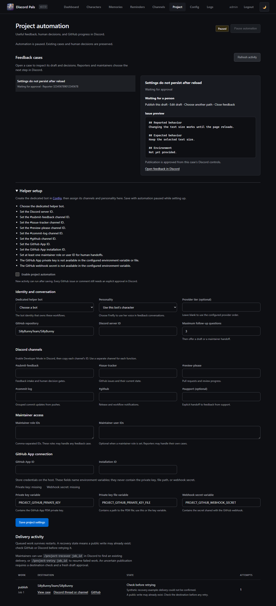

# Project helper

Project automation connects Discord feedback to a GitHub repository. It uses an existing Discord Pals character and text provider, with durable human decisions between assessment and action.

<details>
<summary>Project dashboard preview (synthetic feedback)</summary>



</details>

## Channel behavior

| Channel | Type | Behavior |
| --- | --- | --- |
| `submit-feedback` | Forum recommended; text supported | The helper asks useful questions, proposes a direction, and previews issues or comments for approval. Each report has its own thread. |
| `issue-tracker` | Forum | One post per GitHub issue. Edits and current state are synchronized; closed issues archive and lock their posts; reopening unlocks them. |
| `review-please` | Forum | One post per pull request, with distinct draft, open, closed, and merged states. |
| `commit-log` | Text | Grouped push summaries, including a link to the comparison. |
| `github` | Text | Release and workflow-run notifications. |
| `support` | Text, optional | A user explicitly runs `/feedback report:…` to start a feedback thread. Ordinary support conversations are not copied automatically. |

The configured project channels are reserved for the helper. Other character bots yield those channels. The existing global pause and channel response policy still apply.

## Feedback and personality

1. A reporter posts in `submit-feedback` or uses `/feedback` in support.
2. The helper searches existing GitHub issues and uses its configured character to explain its assessment.
3. The reporter or a configured maintainer chooses **Answer a question**, **Draft now**, **Use existing issue** when suggested, **Ask a maintainer**, or **Close feedback**.
4. Follow-up questions are adaptive and capped by the configured maximum. Free-text corrections produce a new assessment and invalidate old buttons.
5. The helper displays the complete issue or comment draft. **Publish this draft** is a separate approval.
6. GitHub status returns to the feedback thread. A maintainer can post `/ask-reporter Which version are you using?` on the issue to relay a question. Reporter answers become new comment drafts requiring approval.

Human gates have no expiry or automatic approval. Only the reporter, configured maintainer users/roles, or existing deployment operators can act on a case. Old buttons cannot approve a newer draft.

Select Firefly’s existing character entry under **Project → Personality**. Her persona and example dialogue shape conversational assessment and questions. Technical drafts use evidence from the report. Normal character-chat memories, user profiles, and conversation history are not imported into feedback cases. Attachments are recorded as links and are not read by the model in this version.

Feedback body text is sent to the configured text provider for assessment. Public GitHub drafts are shown before publication. The helper does not implement fixes, merge pull requests, or promise release dates. A closed issue is reported as closed; a merged PR is reported as merged.

## Setup

1. Add a dedicated bot identity through **Config**, using the existing bot configuration flow. Select its existing character and configure a text provider.
2. Open **Project**. Set the bot, personality, server, repository, channels, and maintainer roles/users. Save with automation paused.
3. Configure the GitHub App credential environment variables described in [OCI deployment](project-automation-oci.md). The dashboard contains variable names and presence checks, never private keys or webhook secrets.
4. Enable automation after credentials, bot permissions, channel types, and webhook delivery have been checked.

The initial repository default is `SillyBunnyTeam/SillyBunny`. One configured server/repository/helper combination is supported per Discord Pals process.

## Recovery and operations

**Project → Delivery activity** shows job IDs and failure/recovery states. Normal reads retry up to three attempts. An uncertain public write is held: a timeout or process crash does not cause another issue to be created automatically.

- `/project-recover job_id:123` checks the destination for the existing delivery. GitHub matches must bear the configured App’s attribution and the recovery marker.
- `/project-retry job_id:123` resumes failed work or checks a held delivery first.
- If a delivery remains absent, inspect the destination before using `confirmed_not_delivered:true`. A GitHub publication then returns to a fresh draft approval; the old job is cancelled. A Discord delivery can be retried after that explicit confirmation.

These commands require a configured maintainer or operator and the configured project server/helper. Their default Discord visibility requires Manage Server; administrators can grant command access to the maintainer role. Job and case revisions prevent a stale recovery action from replacing a newer decision.

GitHub issues and PRs reconcile on startup and every 15 minutes, including previously tracked items that closed while the webhook was unavailable. Push, release, workflow, and maintainer-question events depend on webhooks; use GitHub’s delivery history to redeliver missed events. Repository and channel changes hold older jobs for their original configuration. New mirror destinations get separate mappings.

The SQLite file is `bot_data/project_automation.sqlite3`. Keep it on persistent local disk. Both built-in update backup paths take a consistent SQLite snapshot, including committed WAL data, instead of copying live journal files. Other backups should use SQLite’s backup API or stop the service before copying its data directory. Retain backups outside the VM for recovery from host loss.

## Implementation boundaries

- `project_automation.py`: decisions, durable jobs, recovery, and lifecycle synchronization.
- `project_automation_ai.py`: task prompt, character context, and validated model response.
- `project_automation_discord.py`: persistent buttons, thread intake, commands, and mirrors.
- `project_automation_github.py`: repository-scoped GitHub App access, event parsing, and marker reconciliation.
- `project_automation_store.py`: SQLite cases, decision audit, mappings, and jobs.
- `project_automation_webhook.py`: signed webhook ingress.
- `project_automation_config.py` and `project_automation_dashboard.py`: normalized settings and operator UI.

One worker processes jobs serially and shares the existing LLM concurrency coordinator. Waiting for people consumes no model calls. The initial active-report cap is three per reporter/server. GitHub list/recovery scans have a bounded 2,000-item ceiling; exceeding it produces a visible failure requiring inspection. Discord recovery searches recent messages/posts and never treats an absent result as permission to republish.

## Verification

```bash
python tools/quality_check.py
python -m pytest -q
python tools/dashboard_smoke.py
ruff check . --exclude venv,bot_data --select E9,F821,F811,F822,F823,F632
```

On Windows, use `python -X utf8` for scripts that print status symbols. Native Discord tests run in a separate test interpreter because the legacy suite installs global SDK stubs. External writes are faked in tests; a configured test server and GitHub App are required for live acceptance.
